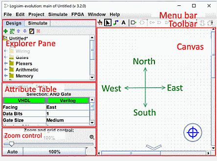

# 基础操作


## 快捷键
- Ctrl+E : 自动传播开启关闭
- Ctrl+I：（信号单步传递）关闭自动传播时，让信号传播一步
- Ctrl+K：	切换时钟：启用/禁用时钟运行（Ticks Enabled）。
- Ctrl+R：	重置仿真：将电路重置到初始状态。
- Ctrl+T：	单步时钟：手动推进一个时钟滴答（Tick Once）。
- F9 ：	完整时钟周期：推进一个完整的时钟周期（两个滴答）
- Ctrl+ D : 复制粘贴
- Ctrl+鼠标滚轮	： 缩放画布

``` txt
关于禁止自动传播时可以像打断点一样调试，现实中这种中间状态是否是同时到达？
No:
不同路径的延迟不同（走线长度、门类型、负载不同）。
信号到达同一门的不同输入端的时刻可能不同。
这会导致竞争（race）和冒险（hazard）现象——输出可能出现短暂的毛刺（glitch）。

```

## ExplorePanel与ToolBar的元件关系
Explore Panel面板
- 内置库：Wiring、Gates、Plexers、Arithmetic、Memory、Input/Output、TTL 等。
- Logisim 库：别人用 Logisim 做好的项目，可以当库加载。
- JAR 库：用 Java 写的扩展库

ToolBar 里的元件是 Explorer Panel 里某些库中工具的“快捷方式”
- 属性相互独立:工具栏里的 AND 工具改成“窄门”，Gates 库里的 AND 工具仍然是“宽门”；如何修改： 点击元件后，AttributeTable中即可修改

## 基础元件链接
[Explore Pane下的Input/Output](./ref/Input&Output.md)

