[学习文档](https://ysyx.oscc.cc/docs/2607/f/3.html#%E9%80%9A%E8%BF%87%E6%99%B6%E4%BD%93%E7%AE%A1%E5%AE%9E%E7%8E%B00%E5%92%8C1)
# 数字电路
## 晶体管
金属-氧化物-半导体场效应晶体管 , 即 MOS ，内有栅极(gate), 源极(source)和漏极(drain)；分为nMOS,pMOS
- nMOS : 当栅极电压与源极电压之间的差值$V_G-V_S$较大时, 源极和漏极导通, 开关合上 , 简单看就是Gate=1时
- pMOS : 当栅极电压与源极电压之间的差值$V_G-V_S$较小时, 源极和漏极导通, 开关合上 ， 简单看就是Gane=0时


<details>
    <summary> 原理  </summary>

        硅是制造半导体的主要材料. 两个4价硅元素之间很容易形成共价键, 从而达到稳定状态. 因此, 纯净的硅材料并不导电.

        以nMOS为例, 制造nMOS时, 需要将少量的3价元素(如硼)作为杂质掺入到硅材料中, 形成P型衬底(上图中的p-substrate). P型衬底中的杂质元素为了和4价的硅元素形成稳定的共价键, 还缺少一个电子, 因此很容易从其他已经形成共价键的位置吸引来一个电子. 但电子离开原来的位置后, 这个位置为了再次形成共价键, 会再次吸引其他电子. 如此反复, P型衬底中就像是存在可以自由移动的电子.

        制造P型衬底后, 在衬底上方挖出两个N区(上图中的n-channel), 并将少量的5价元素(如磷)作为杂质掺入到硅材料中. N区中的杂质元素为了和4价的硅元素形成稳定的共价键, 很容易失去一个电子. 这个电子在N区中自由移动.

        为了方便连接电源, 还需要用金属从两个N区分别引出两个电极, 分别作为源极和漏极. 之后在衬底表面覆盖一层二氧化硅作为绝缘层(上图中的dielectric), 在绝缘层上方再用金属引出一个电极作为栅极.

        工作时, 打开连接源极和漏极和电源. 默认情况下, 源极N区中的自由电子无法跨越P型衬底移动到漏极N区. 此时, 源极和漏极之间并不导通, nMOS处于截止状态.

        此时如果在栅极加足够大的电压, 就会在绝缘体下方形成电场. 在电场的作用下, P型衬底中自由移动的电子将向绝缘体方向移动. 但由于电子无法穿过绝缘体, 因此会聚集在绝缘体下方, 形成一条导电的沟道. 这条沟道连接了源极和漏极, 使得nMOS处于导通状态.
</details>

## 门电路
> 真值表 => 逻辑表达式 => 电路
```
选取输出为1的组合，为0的输入取反，为1的取原式，各类组合用或连接 Y = A ^ B = (A & ~B) | (~A & B)
```
### 非门（反向器）
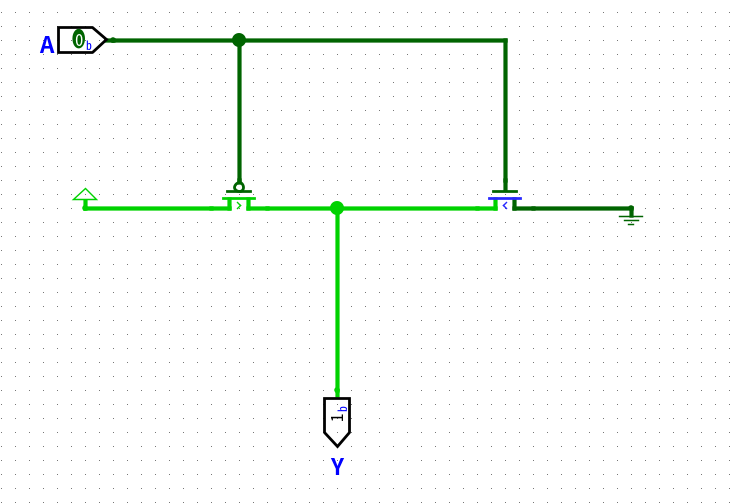

### 与非门
- 与门：全1时才输出1，其余0
- 与非门：全1时才输出0,其余1

与非门如图：
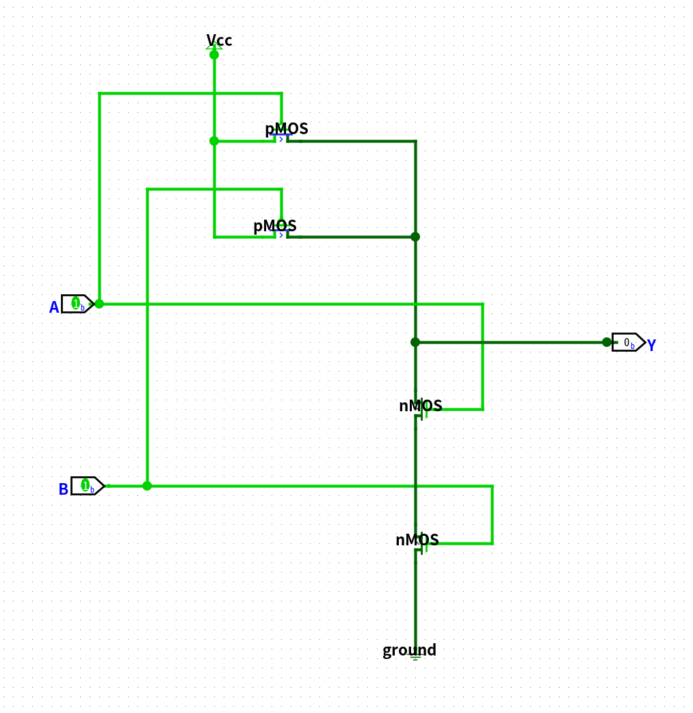
输出接个反向器则成为与门，说明与常识相反，与非门其实在晶体管层级是比与门更基础的

### 或非门
- 或非门：全0才输出1,其余0
- 或门： 全0才输出0,其余1

或非门如图：
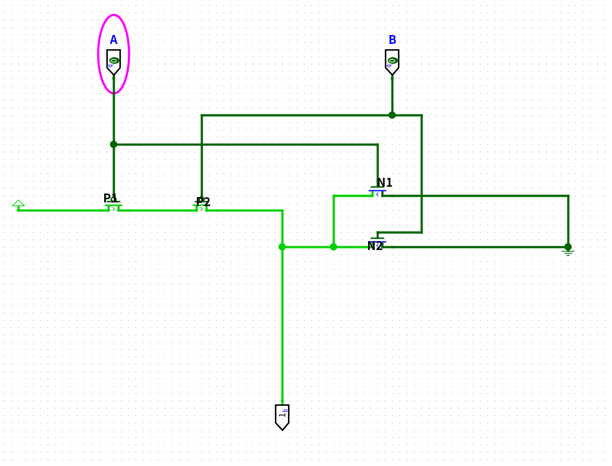
输出接个反向器则成为或门

### 传输门
C与C2始终互补，C=1时Y输出A的值，C=0时，断路，Y无有效值
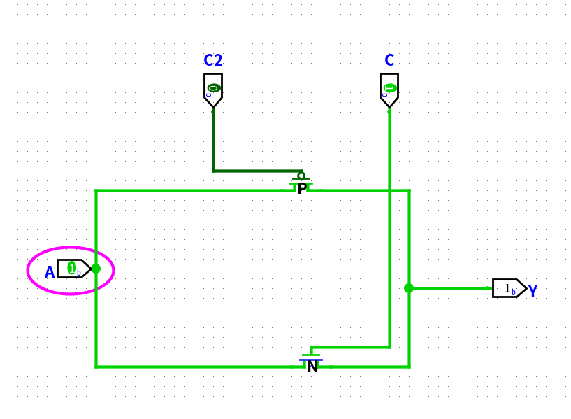

### 异或门
根据真值表，Y=(A&~B)|(~A&B)
画出门电路
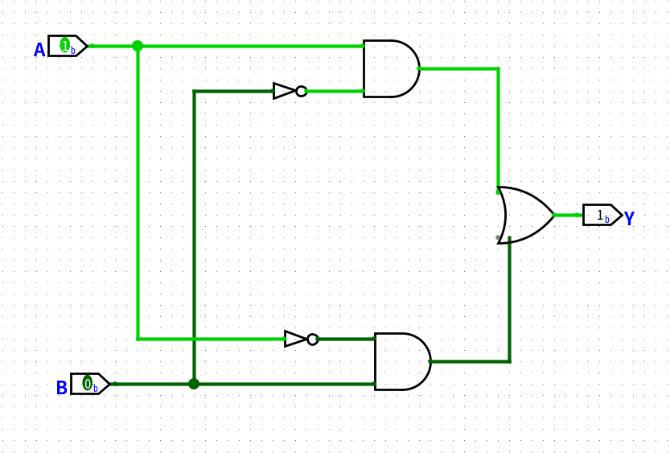

#### 更优方案:<br>
**(1)16晶体管方案**<br>
由于与非门和或非门比与门和非门更基础，因此将上图的门换为基础的形式，
(A&~B)|(~A&B)=(A nand ~B) nand (~A nand B)
由于输出相反，最终连接时
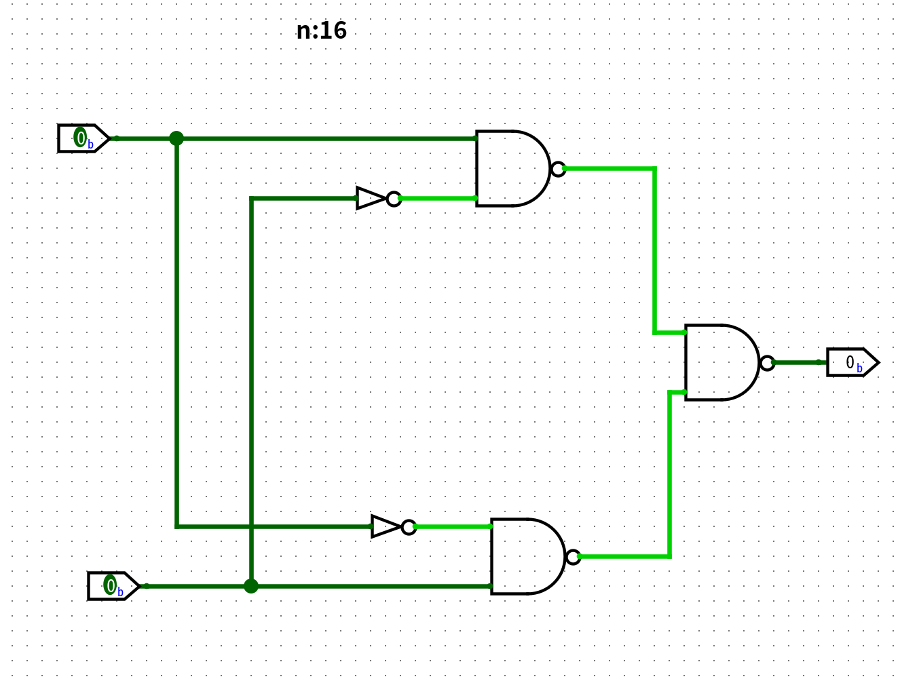

**(2)14晶体管方案**<br>
要得到：输出1则代表两者不同，
意思等价于输入1个0各有一个。即是(1,0),(0,1)两种情况。
但是，这两种情况具有对称性，不好区别，那么就取他的反面：`排除全1和全0的情况`
用逻辑表示就是：`not[ (A and B) or (!A and !B)]`,尽量用nand,nor而不是and,or,那么继续化简：
`not [(A and B)) or (not(A or B))]=(A and B) nor (A nor B)`
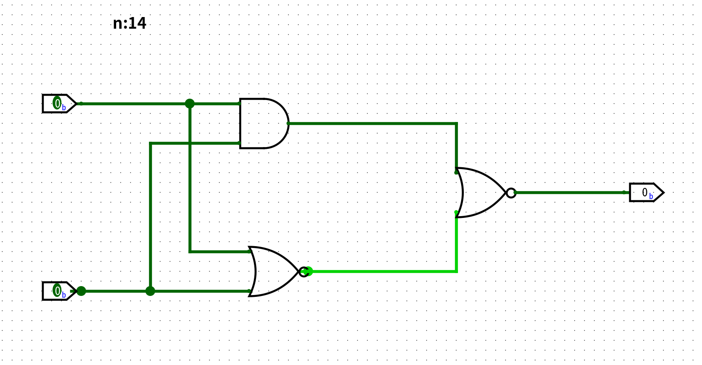

**(3)采用传输门的8晶体管方案**
另一个角度，直接观察真值表：
想要输出1,那么A=1时B需要=0,A=0时B需要=1,前者输出的是!B,后者输出的是B,从A的视角看，
输出B还是!B取决于A的状态，也就是A在控制哪个输出。
那么用两个传输门，一个A=1时输出，一个A=0时输出
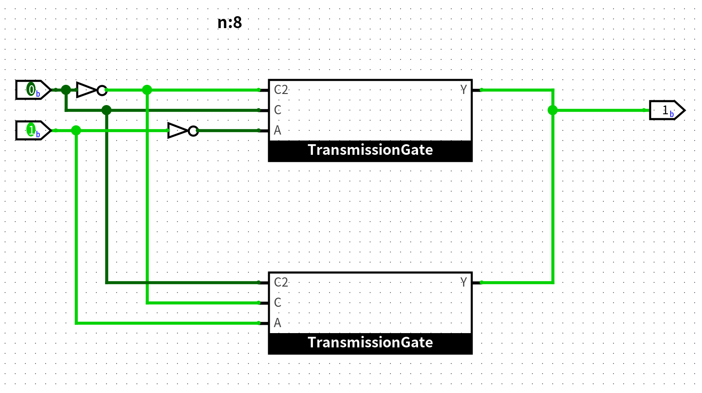

#### 分析晶体管层次的异或门
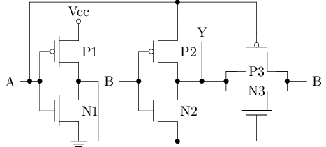
左侧的反向器将下面的线成为~A,而上面的是A,
右侧是A控制的传输门，A=0时导通B,Y=B
下图为逻辑等效的电路图
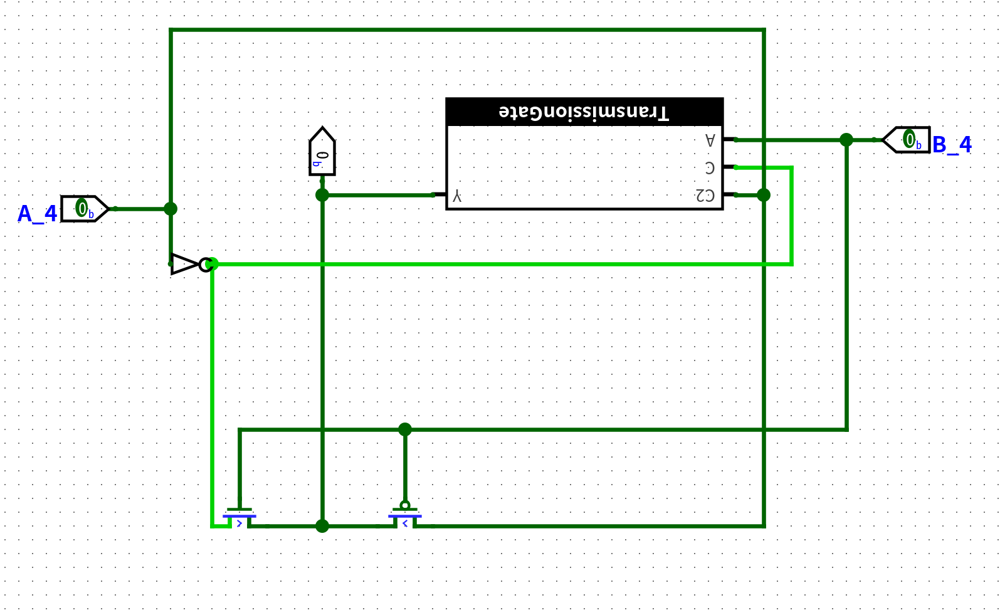
```

----------
思路草稿:
(A nand B) nand (A nor B)  => 1=1和0
1= 有0 ,                  1=没有1  
-----------
1,1=>1
//0,1=>x
0,0=>1
1,0=>0
-----------

0 0 0
1 1 0
1 0 1
0 1 1

------
and nor => nor
(A and B) nor (A nor B) => 1=
1=全1               1=全0
```


## 基本组合逻辑电路
### 译码器(decoder)
译码器将位输入转换成最多种不同输出. 一类常见的译码器是n选1译码器(1-of-n decoder), n位输入，$2^n$位输出: 将输入解析为一个二进制数值, 并使输出的对应位为1, 其他位为0. 由于该输出仅有1位为1, 因此也称为"独热码"(One-hot).
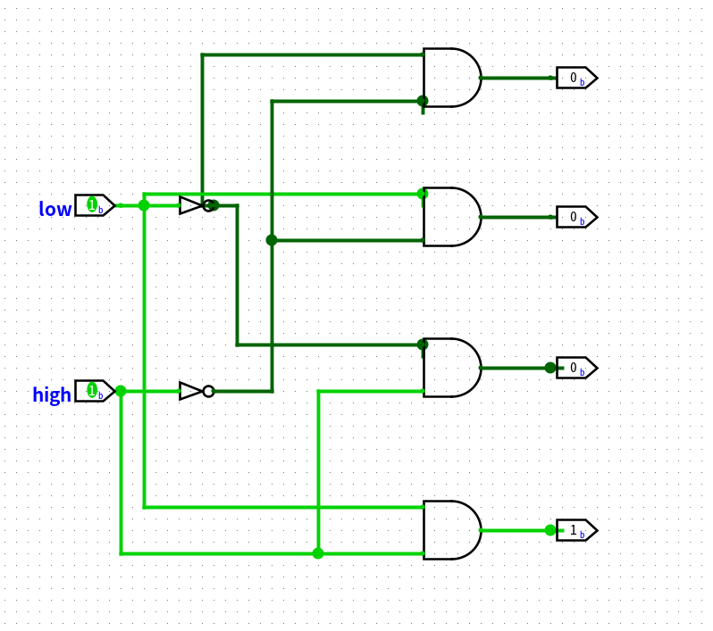

用2_4译码器+与门实现3_8译码器<br>
输入的最高位作为控制信号，为0时禁止后4四个输出（高），为1时禁止前4个输出（低）
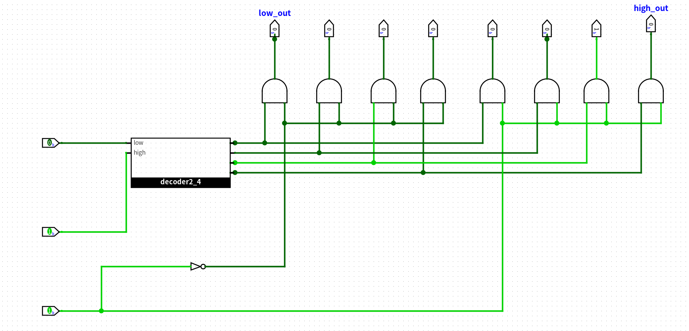

#### 优先译码器

**优先4-2译码器**<br>
$Y_1=A_3 or A_2$ <br>
$Y_0=A_3 or A_1$ <br>
多种输入都可能激活同一位，因此用或门连接
由于优先，高位会抑制低位，当第三位为1时($2_b$),第二位不应激活输出的第一位，因此在从
$A_1到Y_0$的路上放上由$A_2$控制的传输门。并且，被阻断时，由nMOS接地，否则电平会处于未定义状态。
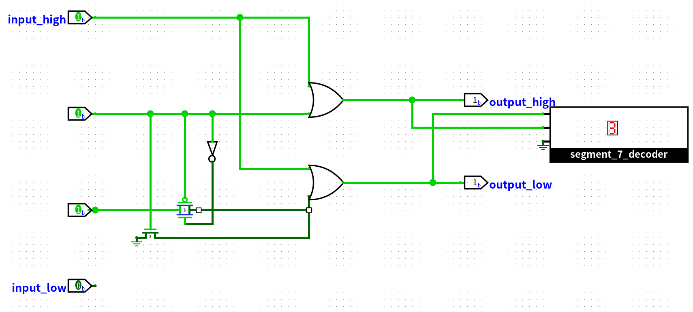
**优先16-4译码器**<br>
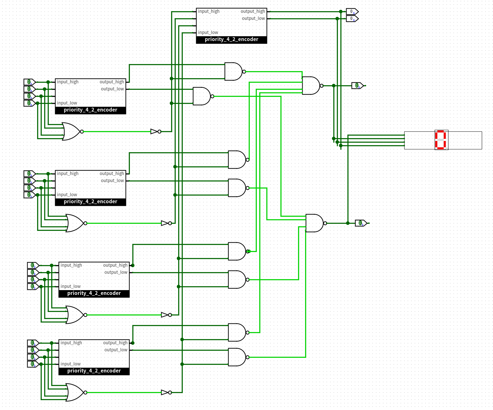
- 大体思路：
>用4-2编码器搭建16-4译码器，可以将16个输入分为4组，每组用4-2编码器处理后得到两位输出，
>并且这2位输出可以在组内唯一映射一种输入。那么还需要定位用哪个组的2位输出，这就需要看哪>一组有输出；而用优先4-2译码器刚好能处理4组，还可以保证组间的优先级。
- 具体分析：
每一组都有两位输出，都可能激活输出，那么还是像以前那样一起接入与门/或门/与非门/或非门。
考虑到尽可能少的晶体管，先用底层的（带非），之后恰好不需要再用反向器反转。
至于此组是否应该输出自身，则需要用到"这个组是否有输出"这个信号(此组所有输入进或非门)：中间信号与组信号一起介入或非门，若有输出，则或非门的输代表出信号（的反），若没有输出，则输出默认的1信号。
如此一来，只有有输入的组会激活相应的输出了。
当然，由于允许多个输入，因此下面这两个输出会有重复的情况(组内相同输入)，不过，上方的4-2译码器使得上面的两个信号可以区分不同组的输入。
### 七段数码管译码器
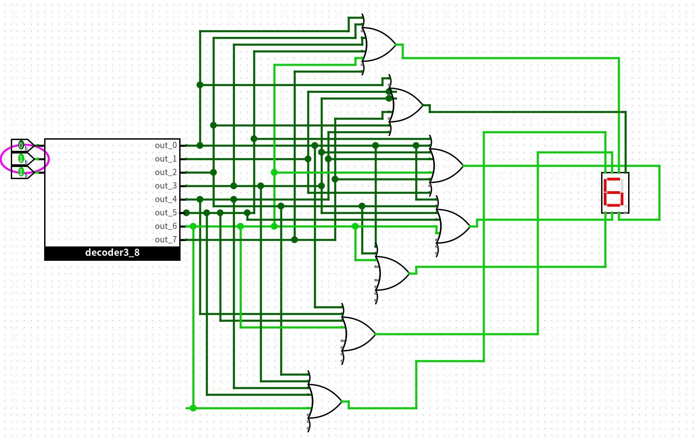
思路：<br>
通过3-8译码器输出独热码，每个独热码代表一个数，<br>
那么这个独热码应该激活他用到的数码管，考虑到多个独热码可能会用到同一根数码管，<br>
他们应该连上同一个**或门**，都能激活或门输出端连接的对应引脚

>Logisim中将数码管显示在实例化子图中：在编辑外观中选择数码管，
> 在属性面板编辑Appearance为Custom*(这点我找了好久)*


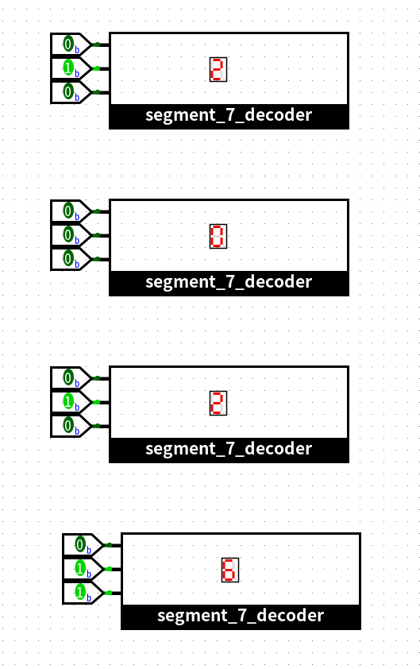
### 编码器(encoder)
输出的即是简单的每一位，只需根据输入的独热码的二进制对照，为1的位需激活对应位，和译码器类似，通过或门实现多个输入都可能激活某一位
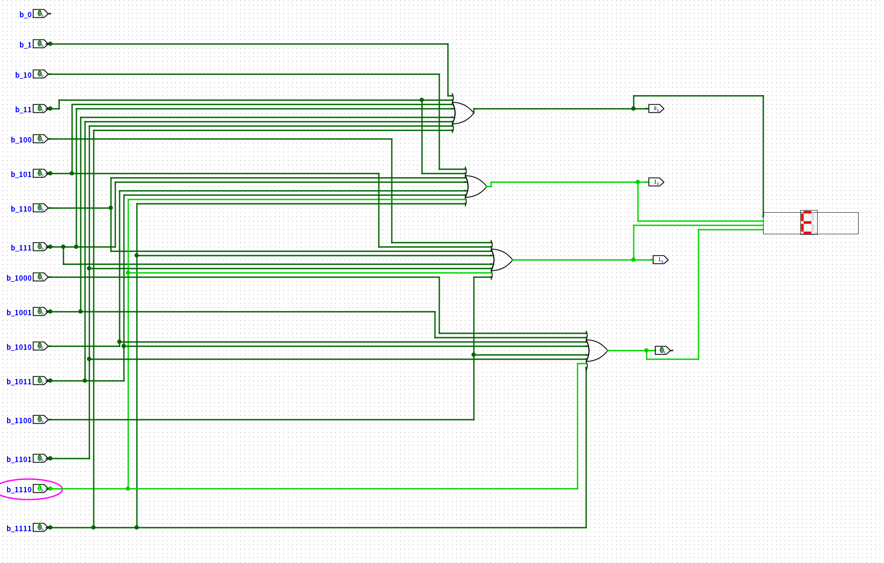

## 多路选择器
### 一位二选一选择器
在[优先译码器](#优先译码器)的优先16-4译码器部分已经想出来了一种控制的思路:
将准备输出的信号与控制信号一起输入与非门/或非门，控制这个门是输出默认值还是输出准备输出信号的反。
若做两个这样的门，只需要将一个控制信号取反，就可以控制两个门中一个输出默认信号，一个输出数据信号的反。
接下来，就应该输出数据信号了。但是由于两边都可能输出数据信号，所以应该设计输出前的最后一个门，其控制信号的允许输出状态应该是前面的门的默认输出，这样最后的门总是允许输出数据，那么另一个输入的数据就输出了。巧妙的是，由于每次过门，数据都取反，因此，最终输出的就是数据本身，不需要多余的取反，节约晶体管
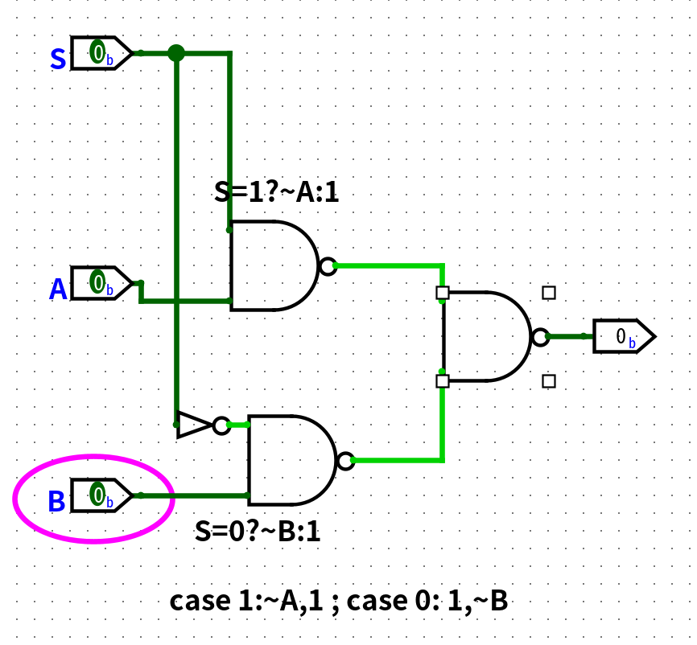
不从门电路搭建，换一个思路的话，既然是选择，就是控制一个输出，控制另一个不输出，就可以简单的
用两个相反状态的传输门输出，最终直接连起来
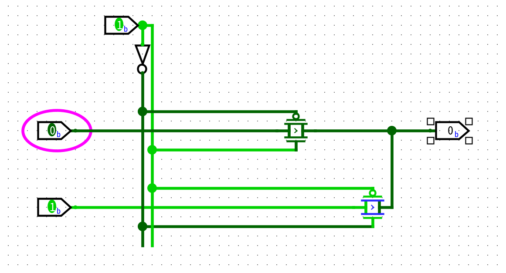